# Desafio SQL — Consultas e Resultados

Abaixo estão as 12 consultas exatamente como executadas, com o print do resultado logo abaixo de cada uma.

## 1 - Buscar o nome e ano dos filmes

```sql
SELECT [Nome], [Ano]
FROM [Filmes].[dbo].[Filmes]
```

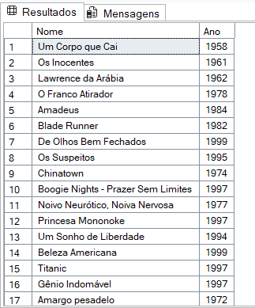

## 2 - Buscar o nome e ano dos filmes, ordenados por ordem crescente pelo ano

```sql
select nome, ano, duracao
from Filmes 
order by ano
```

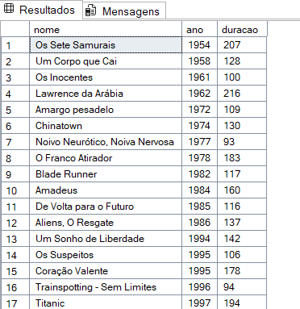

## 3 - Buscar pelo filme de volta para o futuro, trazendo o nome, ano e a duração

```sql
select nome, ano, duracao
from Filmes 
where nome like '%de volta para o futuro%'
```

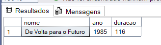

## 4 - Buscar os filmes lançados em 1997

```sql
select nome, ano, duracao
from Filmes 
where ano = 1997
```

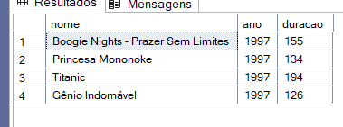

## 5 - Buscar os filmes lançados APÓS o ano 2000

```sql
select nome, ano, duracao
from Filmes 
where ano >2000
```

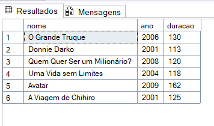

## 6 - Buscar os filmes com a duracao maior que 100 e menor que 150, ordenando pela duracao em ordem crescente

```sql
select nome, ano, duracao
from Filmes 
where Duracao between 101 and 149
order by Duracao asc
```

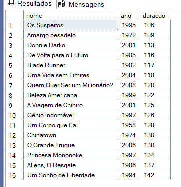

## 7 - Buscar a quantidade de filmes lançadas no ano, agrupando por ano, ordenando pela duracao em ordem decrescente

```sql
SELECT 
  Ano,
  COUNT(*) AS Quantidade
FROM dbo.Filmes
WHERE Ano IS NOT NULL
GROUP BY Ano
ORDER BY Quantidade DESC, Ano ASC;
```

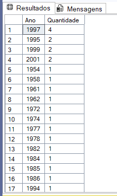

## 8 - Buscar os Atores do gênero masculino, retornando o PrimeiroNome, UltimoNome

```sql
SELECT id, primeironome, ultimonome, Genero
from Atores
where Genero like 'M'
```

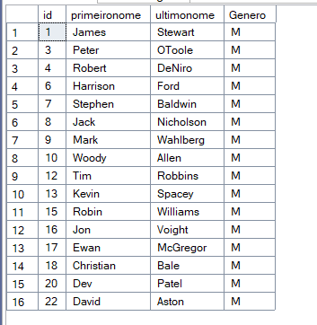

## 9 - Buscar os Atores do gênero feminino, retornando o PrimeiroNome, UltimoNome, e ordenando pelo PrimeiroNome

```sql
SELECT id, primeironome, ultimonome, Genero
from Atores
where Genero like 'F'
order by PrimeiroNome
```

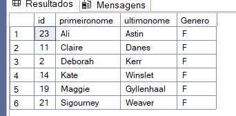

## 10 - Buscar o nome do filme e o gênero

```sql
select nome, genero
from Filmes
inner join FilmesGenero
on filmes.Id = FilmesGenero.IdFilme
left join Generos
on Generos.Id = FilmesGenero.IdGenero
```

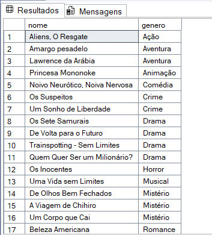

## 11 - Buscar o nome do filme e o gênero do tipo "Mistério"

```sql
select nome, genero
from Filmes
inner join FilmesGenero
on filmes.Id = FilmesGenero.IdFilme
left join Generos
on Generos.Id = FilmesGenero.IdGenero
where Genero like 'Mistério'
```

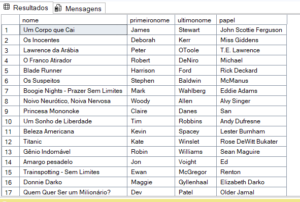

## 12 - Buscar o nome do filme e os atores, trazendo o PrimeiroNome, UltimoNome e seu Papel

```sql
select nome, primeironome, ultimonome, papel
from Filmes
inner join ElencoFilme
on filmes.Id = ElencoFilme.IdFilme
left join atores
on Atores.Id = ElencoFilme.IdAtor
```

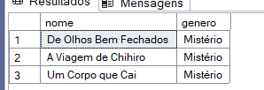

